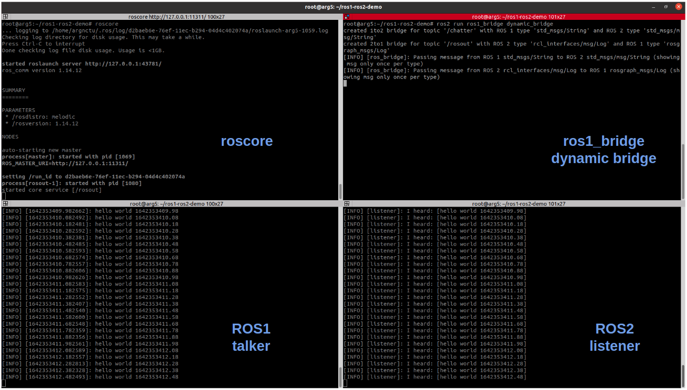

# ros1_bridge Example
In this example, we use `ros1_bridge` package to bridge messages between ROS1 and ROS2 at local machine.



### Terminal 1
Launch ROS1 master.
```
Laptop $ source docker_run.sh

Docker $ source ros1_environment.sh
Docker $ roscore
```

### Terminal 2
Run ROS1 publisher.
```
Laptop $ source docker_join.sh

Docker $ source ros1_environment.sh
Docker $ rosrun rospy_tutorials talker
```

### Terminal 3
Before using ros1_bridge, we need to source ROS1 overlay first, and then source ROS2 overlay.
```
Laptop $ source docker_join.sh

Docker $ source ros1_environment.sh
Docker $ source ros2_environment.sh
Docker $ ros2 run ros1_bridge dynamic_bridge
```

### Ternimal 4
Run ROS2 subscriber.
```
Laptop $ source docker_join.sh

Docker $ source ros2_environment.sh
Docker $ ros2 run demo_nodes_py listener
```

You can also use ROS2 to run talker node and use ROS1 to run listener node.